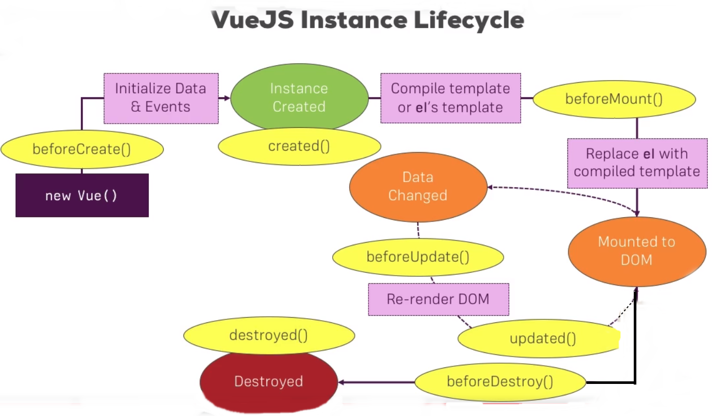

# Vue-js-all

## content

[Resource](#resource) <br/>
[Intro](#intro)<br>
[Vue Life Cycle](#lifecycle)<br>
[Vue CLI](#cli)<br/>
[Vue Components](#components)<br/>
[Advance Component Usage](#componentUsage)<br/>

## resource

#### Documentation

[Official documentation](https://vuejs.org/v2/guide/installation.html)

[Some unofficial docks](https://flaviocopes.com/vue-developer-roadmap/)

[open source projects](https://medium.mybridge.co/30-amazing-vue-js-open-source-projects-for-the-past-year-v-2018-d39a0d019bb7)

[vue-enterprise-boilerplate](https://github.com/chrisvfritz/vue-enterprise-boilerplate)

#### Framework

[vuebulma](https://admin.vuebulma.com/?ref=madewithvuejs.com#/form)

[element](http://element.eleme.io/?ref=madewithvuejs.com#/en-US/)

[iviewui](https://www.iviewui.com/docs/guide/install-en)

#### Animation

[splash screen](https://blog.geekyants.com/vue-login-animation-8adbb88c4047)

[examples](https://vuejsexamples.com/)

#### Tutorial

[Git repo](https://github.com/vuejs/awesome-vue#tutorials)

[Vue school](https://vueschool.io/articles/)

#### Vue.js Best practice

[Style Guide](https://gist.github.com/brianboyko/91fdfb492071e743e389d84eee002342)

[Component Style Guide](https://medium.com/tldr-tech/vue-js-component-style-guide-711988d5e94e)

[4 Tips](https://itnext.io/four-tips-for-working-with-vue-js-b362d97de852)

[Structure Vue.js Project](https://itnext.io/how-to-structure-a-vue-js-project-29e4ddc1aeeb)

[Build Vue Components Like A Pro](https://blog.bitsrc.io/how-to-build-vue-components-like-a-pro-fd89fd4d524d)

[Vue Patterns](https://learn-vuejs.github.io/vue-patterns/patterns/#component-declaration)

#### Info

[Full stack radio](http://www.fullstackradio.com/81)

#### Books

[Design Patterns](https://www.safaribooksonline.com/library/view/vuejs-2-design/9781788839792/)

[Vuejs 2 Design Patterns](https://vk.com/topic-161183987_39079441)

#### Tools

[Design Systems with Vue.js](https://vueds.com/)

#### E2E testing

[Nightwatch](https://www.youtube.com/watch?v=PFU1G2J6LBU)

[Nigthwatch setup](https://vuejs-templates.github.io/webpack/e2e.html)

[Official TestCafe](http://devexpress.github.io/testcafe/documentation/getting-started/#creating-a-test)

[Better E2E testing with TestCafe](https://medium.com/@mwq27/better-e2e-testing-with-testcafe-666aacf2a94e)

[E2E test Vue with TestCafe](https://alligator.io/vuejs/e2e-testing-testcafe/)

[blog TestCafe](https://medium.com/technical-credit/end-to-end-testing-for-react-vue-etc-18b85e10c6f0)

[vue-cli-plugin-e2e-testcafe](https://www.npmjs.com/package/vue-cli-plugin-e2e-testcafe)

[Video example](https://www.youtube.com/watch?v=RWQtB6Xv01Q)

[Git repo with tests](https://github.com/Matterwiki/Matterwiki/tree/master/tests/e2e)

[Top](#content)

## intro

[Guide](https://vuejs.org/v2/guide/)

```javascript
el: "Connect to DOM";
data: "Store Data to be used";
methods: "Methods of this Vue Instance";
computed: "Dependent Properties";
watch: "Execute code upon data change";
```

```html
{{ Always string }} - string Interpolation

<!-- Bind -->
<a v-bind:href="link">{{ title }}</a>
<!-- can be written like this: -->
<a :href="link">{{ title }}</a>

<button v-on:click="functionName">{{ title }}</button>
<!-- can be written like this: -->
<button @click="functionName">{{ title }}</button>
```

```javascript
data: {
    title: "Some link",
    link: "http://..."
}
method: {
    functionName() {
        ...
    }
}
```

### directive

v-once - render only one time <br/>
v-html - render html <br/>
v-on:click - [different event like: mouse leave, input] <br/>
v-model="property" - two way binding <br/>
v-if="data-property" - condition attach detach element from DOM <br/>
v-else-if="data-property" <br/>
v-else <br/>
v-show - hide a element <br/>
v-for="element in data-property [array] elements" - loop <br/>

```html
<ul>
    <li v-for="(elem, index) in elements" :key="elem">{{elem}} {{index}}</li>
</ul>
<template v-for="(elem, index) in elements">
    <h2>elem</h2>
    <p>index</p>
</template>
```

[Top](#content)

## lifecycle

[The Vue Instance](http://vuejs.org/guide/instance.html)



```javascript
new Vue({
  el: "#app",
  data: {},
  beforeCreate: function() {},
  created: function() {},
  beforeMount: function() {},
  mounted: function() {},
  beforeUpdate: function() {},
  updated: function() {},
  beforeDestroy: function() {},
  destroyed: function() {},
  methods: {
    destroy: function() {
      // This destroy instance
      this.$destroy();
    }
  }
});
```

[Top](#content)

## cli

#### Vue-CLI-2

[Learn more about the CLI here:](https://github.com/vuejs/vue-cli)

[webpack template](https://github.com/vuejs-templates/webpack)

```console
sudo npm install -g vue-cli
vue init <template like webpack-simple> <project name>
cd <project name>
npm install
npm run dev

# to build for production
npm run build
```

#### Vue-CLI-3

[Docks](https://medium.com/the-vue-point/vue-cli-3-0-is-here-c42bebe28fbb)

```console
sudo npm install -g @vue/cli
vue create <project name>
# set preset (vue-router, vuex, sass, babel,ts, pwa, eslint, unit-test, E2E test)
cd <project name>
npm run serve
```

###### Adding plugins

```console
vue add <plugin name example vuetify> (no vue-cli-plugin-)
```

[vuetify plugin](https://vuetifyjs.com/en/)

Css -> sass

```console
npm install sass-loader node-sass
add this to style tag
<style scoped lang="scss">
```

###### ENV variables

create .env file in root of project

```javascript
// in .env
VUE_APP_URL = url_to_page;
// TO access in component
export default {
  data() {
    return {
      url: process.env.VUE_APP_URL
    };
  }
};
// in html template
{
  {
    url;
  }
}
// can be set
.env.development
.env.production
.env.test
```

##### Vue CLI GUI

```console
vue ui
```

##### Vue build targets

Vue App

```console
vue build --target app
or
vue build
```

Vue Library

```console
vue build --target lib
```

Vue Web Component

```console
vue build --target wc
```

#### Debugging

[The Vue Developer Tools](https://github.com/vuejs/vue-devtools)

#### Import component

Finally, it's important to be aware of the fact, that you can also load your App.vue File (your main Component/ Instance) via the following Way:

in .babelrc:

```javascript
{
  "presets": [
    ["es2015", { "modules": false }],
    ["stage-2"]
  ]
}
```

in main.js

```javascript
import Vue from "vue";
import App from "./App.vue";

new Vue({
  el: "#app",
  ...App
});
```

[Top](#content)

## components

[Docks](http://vuejs.org/guide/components.html)

[Component registration](https://vuejs.org/v2/guide/components-registration.html)

[Props:](http://vuejs.org/guide/components.html#Props)

[Custom Events:](http://vuejs.org/guide/components.html#Custom-Events)

[Non-Parent-Child Communication:](http://vuejs.org/guide/components.html#Non-Parent-Child-Communication)

Simple component

```javascript
// This register global component
Vue.component("tag-name like my-cmp", {
  data: function() {
    return {
      status: "Critical"
    };
  },
  template:
    '<p>Server Status: {{ status }} <button @click="changeStatus">Change</button></p>',
  methods: {
    changeStatus: function() {
      this.status = "Normal";
    }
  }
});
```

```html
<my-cmp></my-cmp>
```

```javascript
// local component
let com = {
    data: ...
}
new Vue({
    el: '#app',
    components: {
        'my-com': cmp
    }
});
```

#### Communication

From parent to child

```html
<!-- parent -->
<button @click="changeName">Change my Name</button>
<app-user-detail :myName="name"></app-user-detail>
<!--child -->
<p>User Name: {{ myName }}</p>
<p>User Name Reverse: {{ reverseName() }}</p>
```

```javascript
// parent
data: function () {
  return {
    name: 'TestName'
  };
},
methods: {
  changeName () {
    this.name = "Emir"
  }
},
// child
props: {
    myName: {
        type: String,
        required: true
    }
},
methods: {
    reverseName () {
        return this.myName.split("").reverse().join("");
    }
}
// Notice if you passing Object or Array
props: {
    myName: {
        type: Object,
        default: function() {
          return {
            myName: ObjectName.name
          }
        }
    }
},
```

From child to parent

```html
<!-- child -->
<button @click="resetName">Reset name</button>
<!--parent -->
<app-user-detail :myName="name" @nameWasReset="name = $event"></app-user-detail>
```

```javascript
// child
methods: {
  resetName () {
      this.myName = "Reset Name";
      this.$emit('nameWasReset', this.myName);
  }
}
```

From child to parent using callback function

```html
<!-- child -->
<button @click="resetFn()">Reset name with callback</button>
<!--parent -->
<app-user-detail :myName="name" :resetFn="resetName" @nameWasReset="name = $event"></app-user-detail>
```

```javascript
// parent
methods: {
  changeName () {
    this.name = "Emir";
  },
  resetName () {
    this.name = "Reset Callback"
  }
},
```

From child to child using simple child -parent - child communication

```html
<!-- child - edit-->
<p>User Age: {{ userAge }}</p>
<button @click="editAge">Edit Age</button>
<!-- child - details -->
<p>User Age: {{ userAge }}</p>
<!--parent -->
<app-user-edit :userAge="age" @ageWasEdited="age = $event"></app-user-edit>
```

```javascript
// parent
data: function () {
  return {
    name: 'TestName',
    age: 27
  };
},
// child - edit
export default {
  name: "UserEdit",
  props: {
      userAge: {
        type: Number,
        required: true
      }
  },
  methods: {
      editAge () {
        this.userAge = 31;
        this.$emit('ageWasEdited', this.userAge);
      }
  }
}
// child - details
props: {
    myName: {
      type: String,
      required: true
    },
    resetFn: Function,
    userAge: Number
},
```

From child to child using Event Bus (good solution)

```javascript
// main.js
export const eventBus = new Vue();

// child - edit
import { eventBus } from "../main.js";
methods: {
    editAge () {
      this.userAge = 31;
      //  this.$emit('ageWasEdited', this.userAge);
      eventBus.$emit('ageWasEdited', this.userAge);
    }
}
// child - details
import { eventBus } from '../main.js';
created () {
  eventBus.$on('ageWasEdited', (age) => {
      this.userAge = age;
  });
}
```

[Top](#content)

## componentUsage

[Slots:](http://vuejs.org/guide/components.html#Content-Distribution-with-Slots)

[Dynamic Components:](http://vuejs.org/guide/components.html#Dynamic-Components)

[Misc:](http://vuejs.org/guide/components.html#Misc)

#### Slots

```html
<!-- in child component -->
<slot></slot>
<!-- in parent component -->
<app-quote>
  <h2>{{ quoteTitle }}</h2>
  <p>A wonderful quote!</p>
</app-quote>
```

```javascript
// parent
data: function () {
  return {
    quoteTitle: 'The Quote'
  }
},
```

Multiple slots

```html
<!-- in child component -->
<div>
  <div>
    <slot name="title"></slot>
  </div>
  <div>
    <slot name="content"></slot>
  </div>
</div>
<!-- in parent component -->
<app-quote>
  <h2 slot="title">{{ quoteTitle }}</h2>
  <p slot="content">A wonderful quote!</p>
</app-quote>
```

##### dynamic components

```html
<button @click="sleectedComponent = 'appQuote'">Quote</button>
<button @click="sleectedComponent = 'appAuthor'">Author</button>
<button @click="sleectedComponent = 'appNew'">New</button>
<component :is="sleectedComponent">
  <h2 slot="title">{{ quoteTitle }}</h2>
  <p slot="content">A wonderful quote!</p>
</component>
```

```javascript
data: function () {
  return {
    quoteTitle: 'The Quote',
    sleectedComponent: 'appQuote'
  }
},
components: {
  appQuote: Quote,
  appAuthor: Author,
  appNew: New
}
```

To not destroy component:

```html
<keep-alive>
  <component :is="sleectedComponent">
    <h2 slot="title">{{ quoteTitle }}</h2>
    <p slot="content">A wonderful quote!</p>
  </component>
</keep-alive>
```

[Top](#content)
